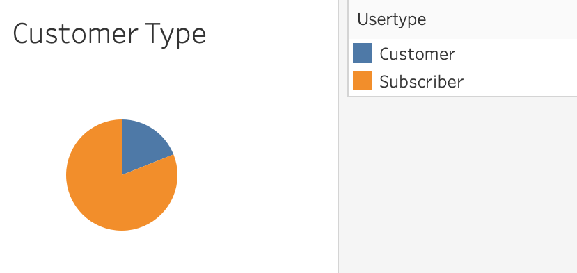
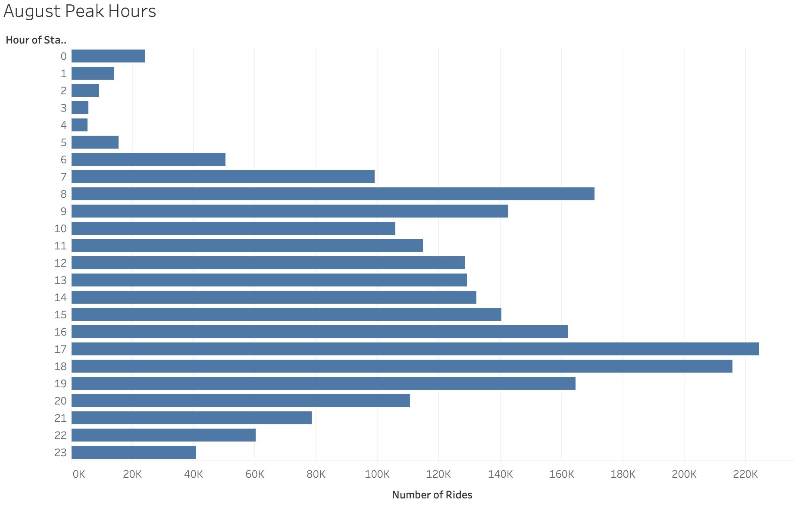
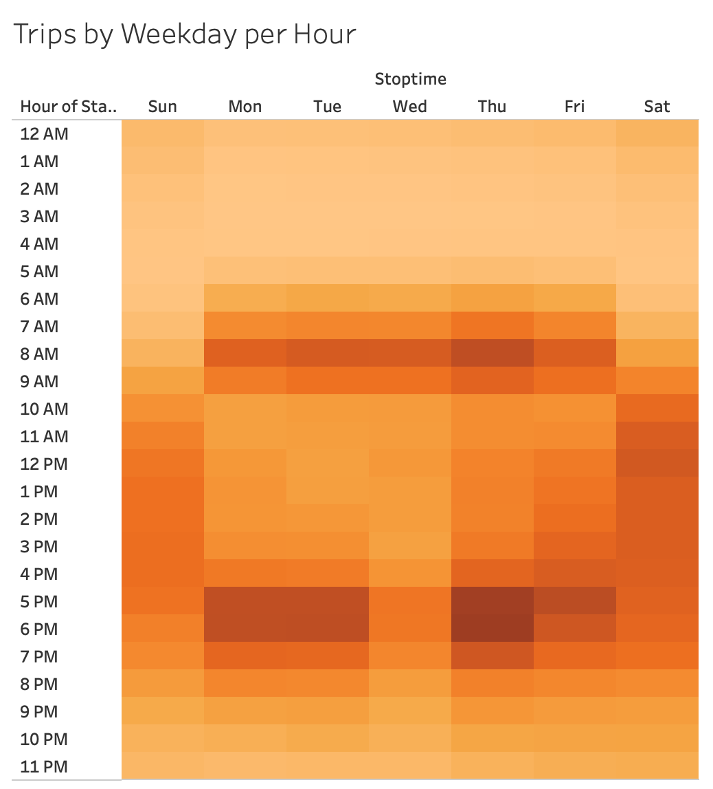
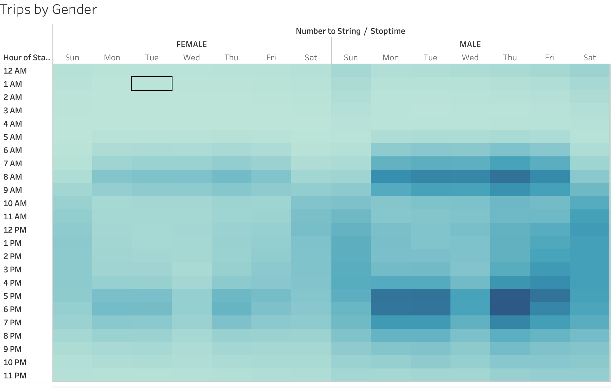
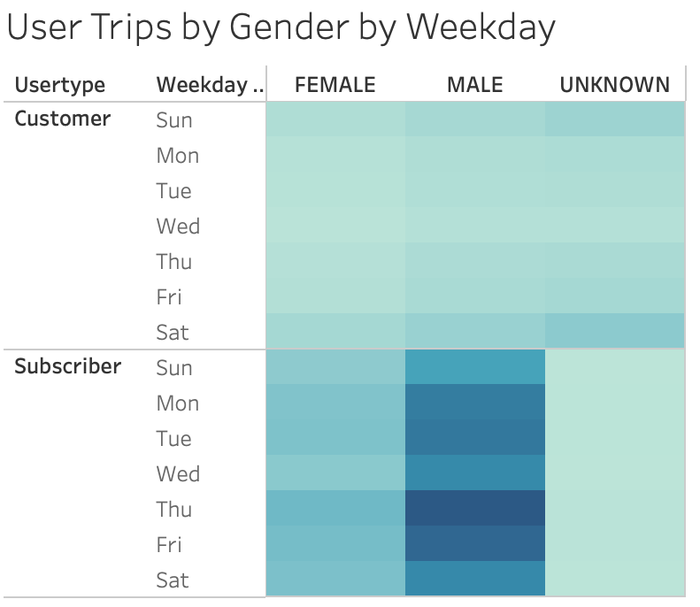
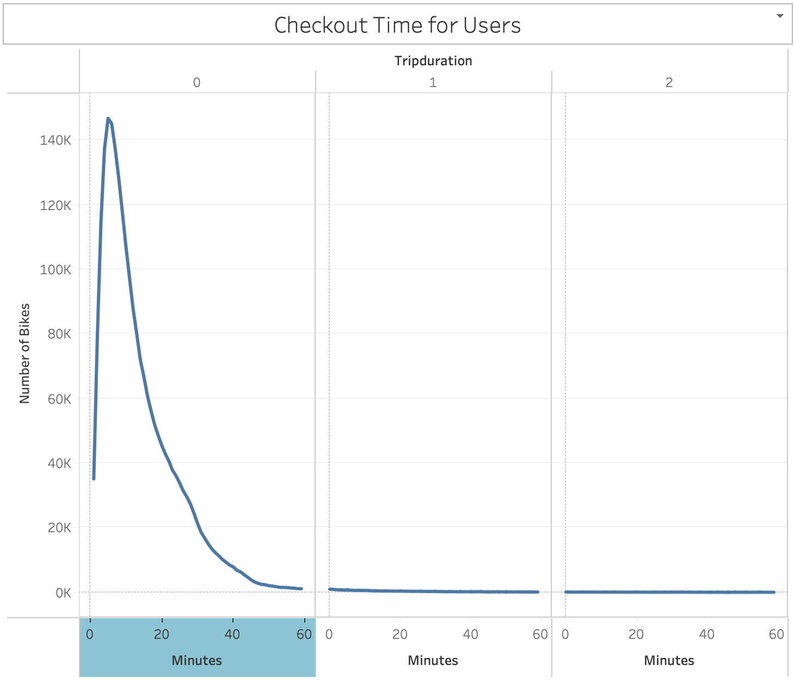
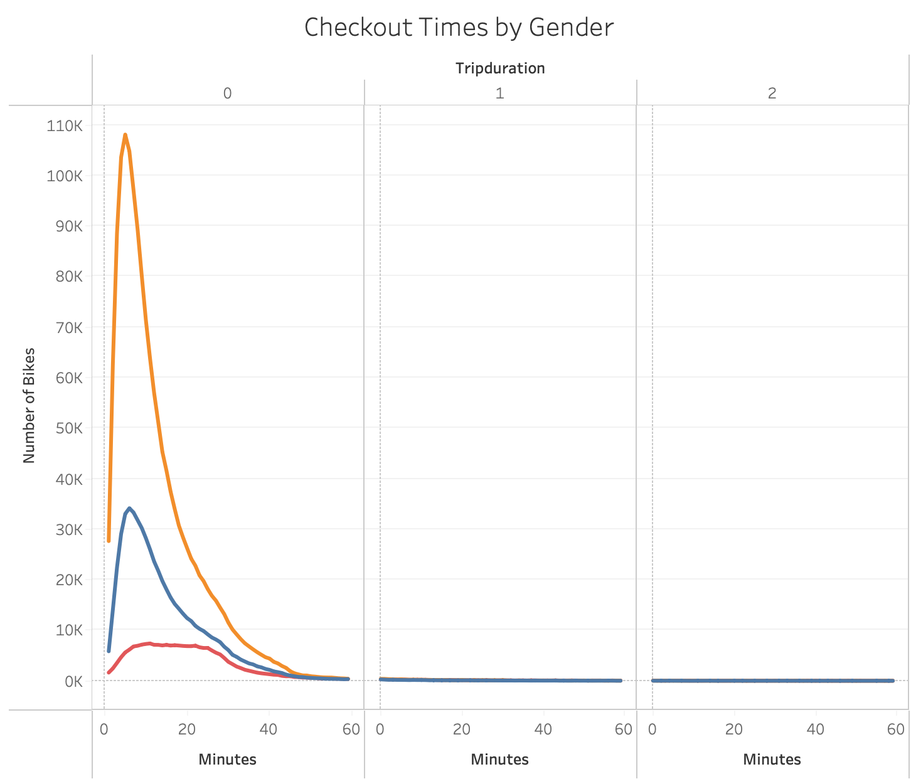

# Bike-Sharing

## Overview
This project analyzes different aspects of how CitiBikes are used throughout NYC to inform an effort to bring bike-sharing resources to Des Moines, Iowa.  This analysis considers who is the biggest population of users, the most used times of the day/week and length of time that bikes are typically used.

You can find the final dashboard [here](https://public.tableau.com/shared/QPCQQ4X4H?:display_count=n&:origin=viz_share_link).

## Results
Below are the findings from the NYC CitiBike analysis:

### Customer Type

- Over 75% of users for the month of August were monthly subscribers which is safe to assume they are repeat users.

### August Peak Hours
 
- Throughout the month of August, the hours of 5 & 6pm were the times that bikes were most utilized

### Trips by Weekday

- Expanding on peak hours, we are able to see that in addition to 5-6pm being a highly utilized time of day, we can also see that Saturdays and Sundays are also highly used days for bike-sharing

### Trips by Gender

- This breakdown shows that men are the majority of users that are occupying the highly used time slots.

### User Trips by Gender

- This view compiles the 3 different attributes into 1 view: Subscribers who are men are for more likely to bikeshare than all women and women who are subscribers.

### Checkout Time for Users

- The view above displays the average amount of time someone checks out a bike.  From this visual we can determine that majority of bike rentals total rental time is within 0-20 minutes.

### Checkout Time by Gender

- This visual breaks down the usage time by gender, showing that men (orange) are far exceeding the amount of rides as women (blue) and unknown (red), however the duration of the rides seem to be in a similar porportion.

## Summary
In summary, we can determine that subscribers are for more likely to utilize bike-sharing than 1 times users and of those subscribers, men far outweigh women in using the service. In order to get a little better understanding of some of the other dynamics of bike-sharing, there are some other visuals that may help make a more informed decision:

1. Since Des Moines is a more rural city than NYC, it would be helpful to see rural bike sharing usage compared to urban usage.

2. It would be helpful to know what the age is of the population using the bikesharing service.  If average age of the population of Des Moines falls outside of the average age using the bikes in NYC, it may not be ideal to start that service within Des Moines. 
